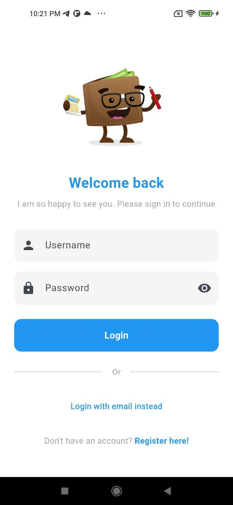
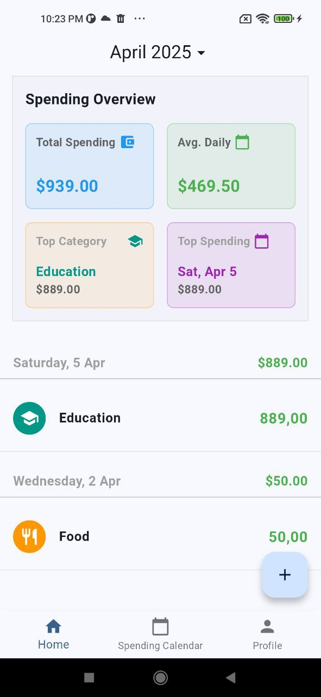
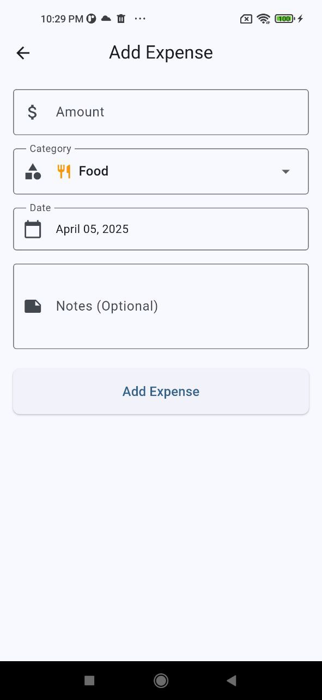
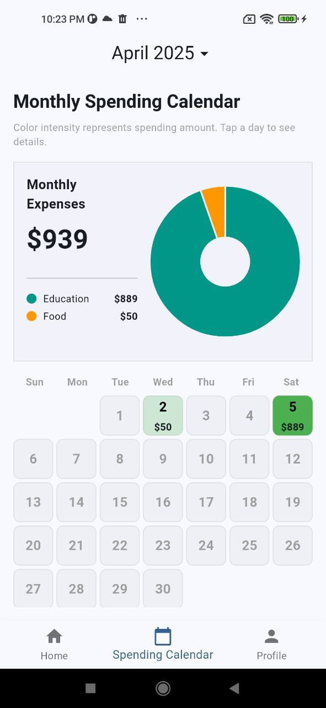
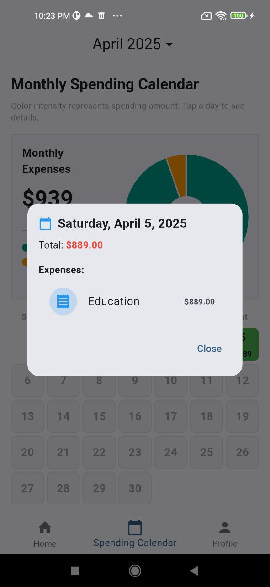

# Personal Expense Tracker - Documentation

## Project Overview

The Personal Expense Tracker is a full-stack mobile application that helps users track their daily expenses, categorize them, and view monthly analytics. The application consists of a Flutter frontend and a Node.js/Express.js backend with SQLite database.

## Table of Contents

- [Personal Expense Tracker - Documentation](#personal-expense-tracker---documentation)
  - [Project Overview](#project-overview)
  - [Table of Contents](#table-of-contents)
  - [Architecture](#architecture)
  - [Backend](#backend)
    - [Environment Setup](#environment-setup)
    - [Database Schema](#database-schema)
    - [API Endpoints](#api-endpoints)
      - [Authentication Endpoints](#authentication-endpoints)
      - [Expense Endpoints](#expense-endpoints)
    - [Authentication](#authentication)
  - [Frontend](#frontend)
    - [Project Structure](#project-structure)
    - [State Management](#state-management)
    - [Repository Pattern](#repository-pattern)
    - [Screens](#screens)
    - [Services](#services)
  - [Setup Instructions](#setup-instructions)
    - [Backend Setup](#backend-setup)
    - [Frontend Setup](#frontend-setup)
  - [Usage Guide](#usage-guide)
    - [User Authentication](#user-authentication)
    - [Expense Management](#expense-management)
  - [Screenshots](#screenshots)

## Architecture

The application follows a client-server architecture:

- **Frontend**: Flutter mobile application that communicates with the backend API
- **Backend**: RESTful API built with Node.js and Express.js
- **Database**: SQLite for data persistence
- **Authentication**: JWT (JSON Web Tokens) for secure authentication

## Backend

### Environment Setup

The backend requires the following environment variables in a `.env` file:

```
PORT=3000
JWT_SECRET=your_secret_key
DB_PATH=./src/db/database.sqlite
```

### Database Schema

The application uses SQLite with the following schema:

**USERS Table**
- `ID` (primary key, auto-increment)
- `USERNAME` (unique)
- `EMAIL` (unique)
- `HASHED_PASS` (securely hashed password)
- `CREATED_AT` (default: current timestamp)

**EXPENSE Table**
- `ID` (primary key, auto-increment)
- `USER_ID` (foreign key referencing USERS.ID)
- `AMOUNT` (decimal)
- `CATEGORY` (text)
- `DATE` (date)
- `NOTES` (text, optional)
- `CREATED_AT` (default: current timestamp)

### API Endpoints

#### Authentication Endpoints

| Endpoint | Method | Description | Authentication Required |
|----------|--------|-------------|------------------------|
| `/api/auth/register` | POST | Register a new user | No |
| `/api/auth/login` | POST | Login a user | No |
| `/api/auth/profile` | GET | Get user profile | Yes |

#### Expense Endpoints

| Endpoint | Method | Description | Authentication Required |
|----------|--------|-------------|------------------------|
| `/api/expenses` | GET | Get all expenses | Yes |
| `/api/expenses/:id` | GET | Get expense by ID | Yes |
| `/api/expenses/month/:year/:month` | GET | Get expenses by month | Yes |
| `/api/expenses` | POST | Create a new expense | Yes |
| `/api/expenses/:id` | PUT | Update an expense | Yes |
| `/api/expenses/:id` | DELETE | Delete an expense | Yes |

### Authentication

The backend uses JWT for authentication. When a user logs in or registers, the server returns a JWT token that should be included in subsequent requests in the Authorization header:

```
Authorization: Bearer <token>
```

## Frontend

### Project Structure

The Flutter frontend is organized as follows:

- `lib/models/` - Data models (User, Expense)
- `lib/data/` - Repository pattern implementation
  - `lib/data/repository/` - Repository interfaces
  - `lib/data/repository/api/` - connecting my repository to backend
  - `lib/data/dto` - data transfer object for model
- `lib/ui/screens/` - UI screens
- `lib/ui/providers/` - State management using Provider
- `lib/ui/widgets/` - Reusable UI components
- `lib/ui/theme/` - App themes and styling
- `lib/utils/` - Utility classes and helper functions

### State Management

The application uses the Provider package for state management with two main providers:

1. **AuthProvider**: Manages user authentication state
   - User login/registration
   - User profile information
   - Authentication token management

2. **ExpenseProvider**: Manages expense data and operations
   - Fetching expenses
   - Adding/editing/deleting expenses
   - Filtering by month
   - Calculating summaries

### Repository Pattern

The app implements the repository pattern to separate data sources from business logic:

1. **AuthRepository**: Interface for authentication operations
   - **AuthApiRepository**: Implementation using backend API

2. **ExpenseRepository**: Interface for expense operations
   - **ExpenseApiRepository**: Implementation using backend API

### Screens

1. **LoginScreen**: User login with username and password
2. **RegisterScreen**: New user registration
3. **HomeScreen**: Main screen displaying expense list and monthly summary
4. **AddExpenseScreen**: Form for adding or editing expenses
5. **ProfileScreen**: User profile information and logout option

### Services

1. **AuthService**: Handles API communication for authentication
2. **ExpenseService**: Handles API communication for expense operations

## Setup Instructions

### Backend Setup

1. Navigate to the backend directory
```
cd backend
```

2. Install dependencies
```
npm install
```

3. Create a `.env` file with the required variables

4. Start the server
```
npm start
```

For development with auto-restart:
```
npm run dev
```

### Frontend Setup

1. Navigate to the frontend directory
```
cd frontend
```

2. Install dependencies
```
flutter pub get
```

3. Update API URL in `lib/services/api_constants.dart` if needed:
```dart
static const String baseUrl = 'http://10.0.2.2:3000/api';  // For Android emulator
// For physical device, use the actual IP address of your backend
// static const String baseUrl = 'http://192.168.1.x:3000/api';
```

4. Run the app
```
flutter run
```

## Usage Guide

### User Authentication

1. **Registration**: New users can create an account by providing username, email, and password
2. **Login**: Existing users can log in with their username and password
3. **Profile**: Users can view their profile information
4. **Logout**: Users can log out from the application

### Expense Management

1. **Adding Expenses**: 
   - Tap the '+' floating action button
   - Enter amount, select category, date, and optionally add notes
   - Tap 'Add Expense' to save

2. **Viewing Expenses**:
   - All expenses are displayed in a list on the home screen
   - Expenses are grouped by the selected month
   - Tap on the month name in the app bar to change the month/year

3. **Editing Expenses**:
   - Tap the three dots on an expense card
   - Select 'Edit' from the popup menu
   - Update the information and tap 'Update Expense'

4. **Deleting Expenses**:
   - Tap the three dots on an expense card
   - Select 'Delete' from the popup menu
   - Confirm deletion

5. **Expense Analytics**:
   - The home screen displays a summary card showing:
     - Total expenses for the month
     - Top expense categories with percentages

## Screenshots

Here are some screenshots of the application:


*Login screen with username and password fields*


*Home screen showing expense list*


*Form for adding a new expense*

[Edit Expense](screenshots/photo_1_2025-04-05_22-29-31.jpg)
*Form for Editing expense*


*Monthly expense analytics*


*view day details of how much spent*


*User profile information*

